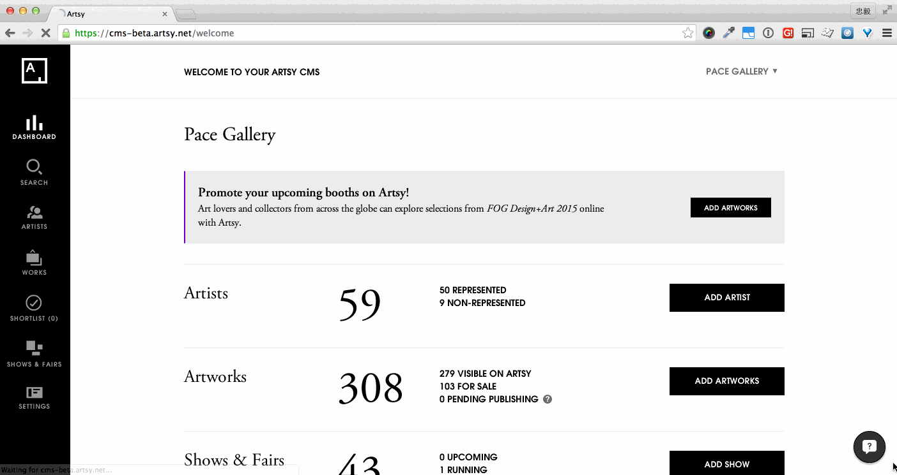

# Front-end Patterns

Here we compile a list of front-end patterns that might be useful in client apps. For each of them, we provide the usage and examples to help you seemlessly include it in your client apps, and also point you to the source files if you want to dig into it.

- [Callback Triggers](#callback-triggers)
- [Remote Animation](#remote-animation)

## Callback Triggers
|||
|----|---|
|**source**|[vendor/assets/javascripts/watt/callback_triggers.js.coffee](../vendor/assets/javascripts/watt/callback_triggers.js.coffee)|

[Front-end callbacks](https://github.com/artsy/kinetic/blob/master/doc/front_end_callbacks.md) are AJAX calls running on the client side to fetch and render part of views after a page loads. It is a useful pattern to reduce the initial page load time.

The callback triggers here in Watt manually clicks all the [UJS links](https://github.com/rails/jquery-ujs) on the page and triggers the following behavior in controllers (usually fetching some data and rendering views). All the UJS links (with `data-remote="true"` and `data-callback="true"`) will be treated as callback links and will be clicked.

#### Usage
Follow the pattern in [front-end callbacks](https://github.com/artsy/kinetic/blob/master/doc/front_end_callbacks.md) and specify `data-remote="true"` and `data-callback="true"` in the UJS links. The callbacks should be automatially triggered after the page loads.

#### Examples
On Volt's welcome page, we render the partner stats via [front-end callbacks](https://github.com/artsy/volt/blob/9f2669bb347bf7b9b3276c34414b3e39ce402f72/app/views/home/_stats_modules.haml#L10). An example looks like this and the callback triggers will click the link for you:

```haml
= link_to '', dashboard_stats_partner_artists_path(callback: true, callback_replace: '.artists-stats-section .artists-stats-data'), remote: true, data: { no_turbolink: true, callback: true }
```



As demonstrated in the screencast, displaying a loading spinner initially and replacing it with fetched content provides a good user experience.

## Remote Animation

TODO
